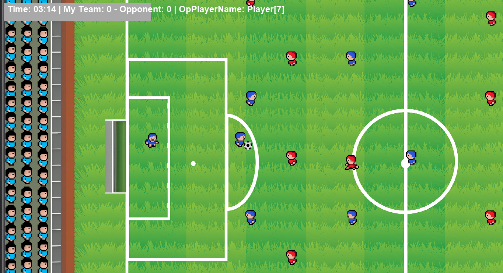
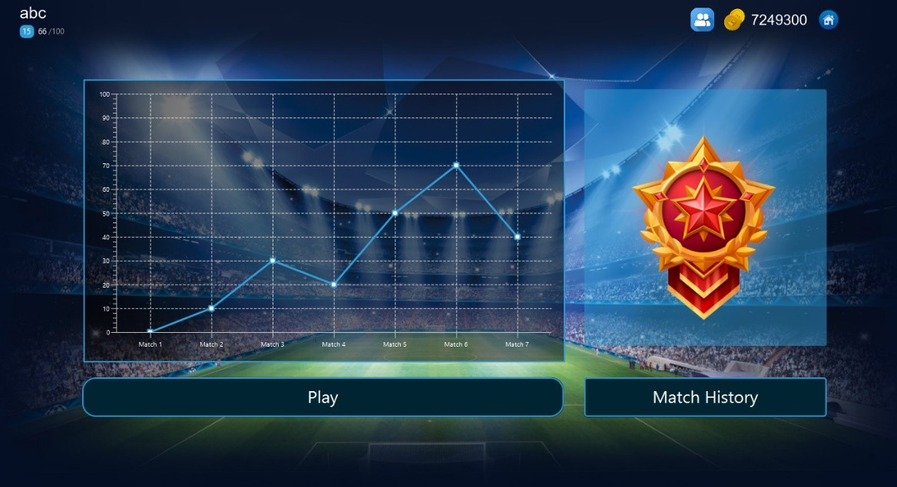
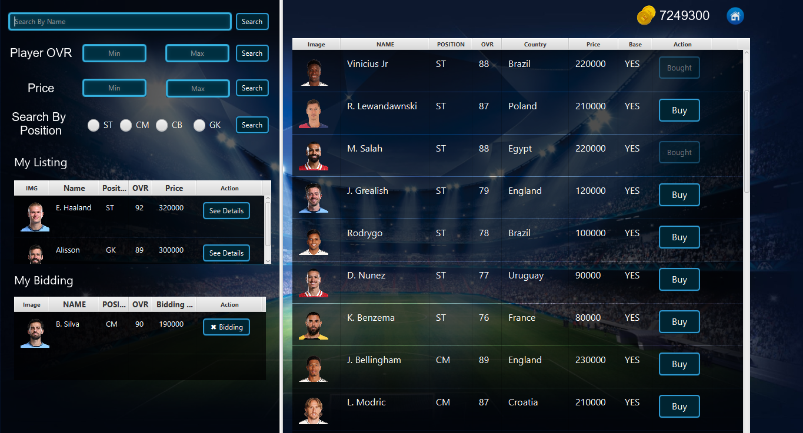
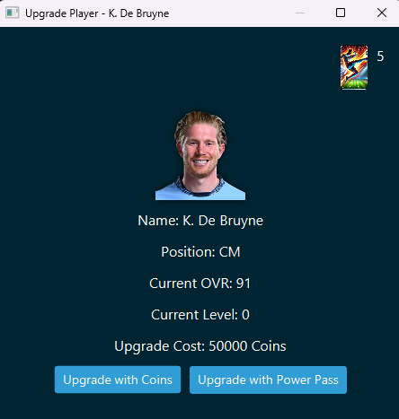
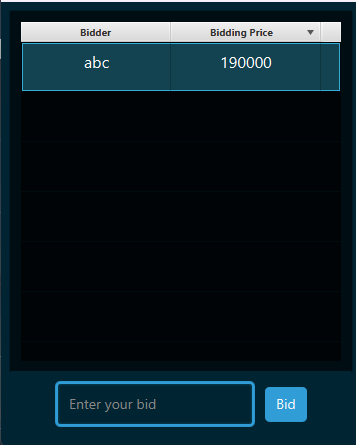
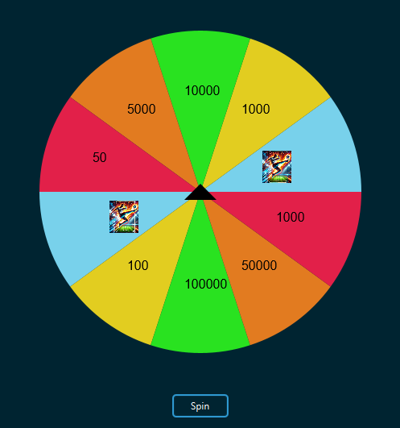
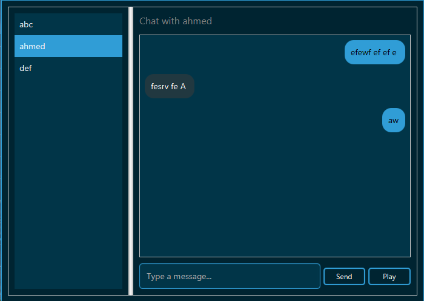
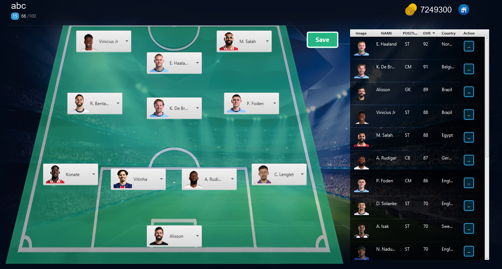

# Football Game with JavaFX
It's the first multiplayer Football game that's been created using only Java. 
It's a 2D multiplayer football game with competitive features such as a player marketplace, ranking system, and rewards. The game should allow players to challenge others in 1v1 matches, trade and upgrade players, and engage in various interactive mechanics like messaging and spinning rewards.

## Features
<b>1.	Multiplayer 1 vs 1 Matches : </b>  Players can challenge real opponents online.

 

<b>2.	Custom Play with Friends : </b>  Private match options for playing against friends.

<b>3.	Reward System : </b>  Players earn rewards based on match results.

<b>4.	Competitive Ranking : </b>  Players ranking will be determined by their performance.

 

<b>5.	Marketplace for Player Buy & Sell : </b>  Users can trade and manage players.

 

<b>6.	Upgrade System  : </b>  Players can upgrade and enhance player attributes.

 

<b>7.	Bidding System  : </b>  Auctions for premium upgraded players.

 

<b>8.	Daily Rewards (Spin the Wheel)   : </b>  Incentives for daily engagement.

 

<b>9.	Messaging System   : </b>  In-game communication for players.

 

<b>10. Customize team   : </b>

 

## Techniques Used for Implementing Core Features:
1.	<b>Game Development </b>
    1.	GraphicsContext
    2.	Canvas
    3.	Custom tile set
2. <b>Networking : </b> Socket Programming
3. <b>Database Management : </b> MySQL for storing users and player data
4. <b>Ranking System : </b> Elo rating system to maintain fair competition.
5. <b>Marketplace & Bidding : </b> Complicated  functions to manage player transactions securely.
6.	<b>UI & UX Design : </b> Scenebuilder for login page, Main Menu etc
7.	<b>Messaging : </b> MySQL Realtime Database and WebSocket-based communication.

## Conclusion
 Our project aims to create an engaging, fair, and competitive 2D multiplayer football experience. By integrating features like ranking, and in-game marketplace, player upgrades, and matchmaking, we ensure long-term user engagement. 
